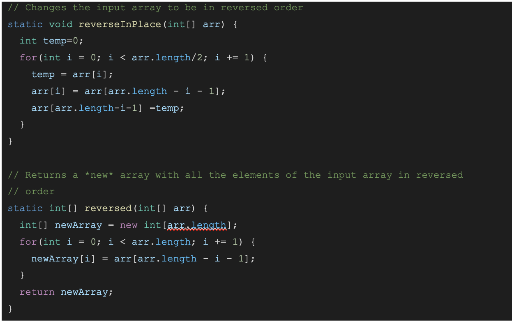

PART ONE:
    
    public String handleRequest(URI url) {
        if (url.getPath().equals("/")) {
            String temp ="";
            for(int i = 0; i<list.size(); i++){
                temp += list.get(i) + ", ";
            }
            return temp;
        } else if (url.getPath().contains("/add")){
            System.out.println("Path: " + url.getPath());
            String[] parameters = url.getQuery().split("=");
            list.add(parameters[1]);
            String temp ="";
            for(int i = 0; i<list.size(); i++){
                temp += list.get(i) + ", ";
            }
            return parameters[1] + " added! List is now "+ temp;
        }
        else if(url.getPath().contains("/search")){
            System.out.println("Path: " + url.getPath());
            String[] parameters = url.getQuery().split("=");
            String temp ="";
            for(int i = 0; i<list.size(); i++){
                if(list.get(i).contains(parameters[1])){
                    temp += list.get(i) + "   ";
                }
            }
            return temp;
        }
        return "404 Not Found!";
    }
}

* this method is handlerequest()
* the value of the argument "url" is "/add?s=anewstring"
* this value stays constant

* this method is handlerequest()
* the value of the argument "url" is "/search?s=str"
* this value stays constant

* this method is handlerequest()
* the value of the argument "url" is "/error"
* this value stays constant

PART TWO:
Faliure inducing input: 

Symptom:

Bug fix:

This bug was that the code was swapping the second half of the array into the first half without saving the first half as a variable. For this input, the bug will simply put a duplicate in the second half of the array instead of the original values. In the second method, it was setting the old array values as the new empty array values, and returning the old array. For this input, this caused the returned arrays to always be 0.

Faliure inducing input: 

Symptom:

Bug fix:

This bug was that the code was adding the values into the ArrayList in position 0. This would cause all of the arrayLists to be in reverse order. 

