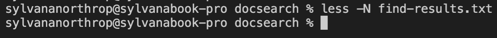
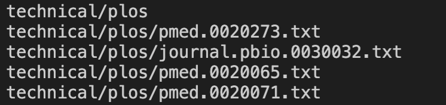
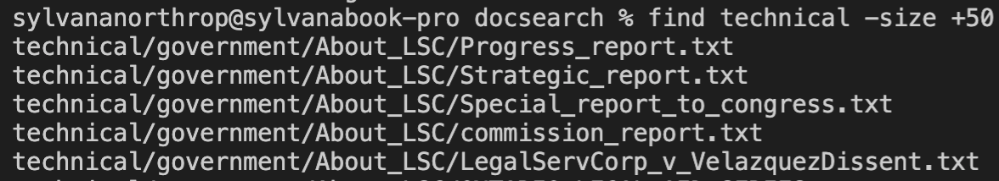
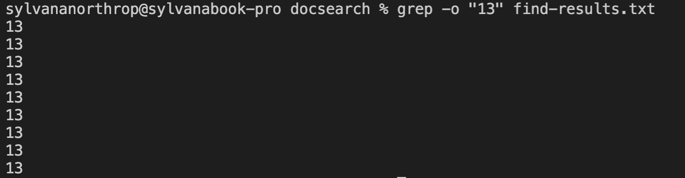
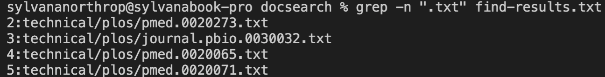

less -E : 
* this command exits out of the display as soon as you scroll to the bottom
* this is useful when you want to quickly go through a file without any extra steps

less -N :
* this command puts line numbers next to the display
* this is useful when you are looking for a certain line

less -n :
* this command removes line numbers next to the display
* this is useful when you want less clutter to look at

find . -name :
* this command finds a file of a certain name in
* this is useful when you want to check to see if a file is where it should be

find . -type :
* this command finds files in a working directory of a certain type
* this is useful when you have multiple files named the same thing, and you want to specify which one you want

find -size :
* this command finds files above or below a size parameter
* this is useful when finding out which files take up the most space

grep -i :
* this command locates a file by name without case sensitivity
* this is useful when you dont recall exactly how you named a file

grep -o :
* this command lists out all the cases of a string found within the file
* this is useful when you want to visualize how many instances of the string there are

grep -n :
* this command puts line numbers where each file was found next to the found results
* this is useful to visualize what line each of the cases are on

