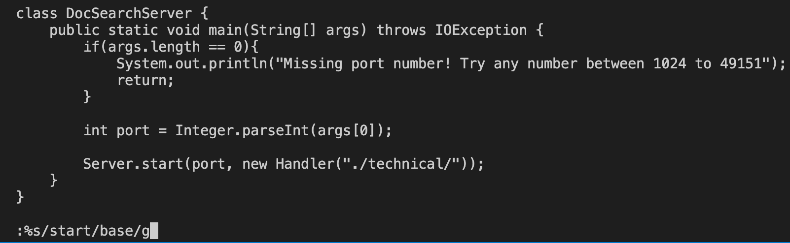
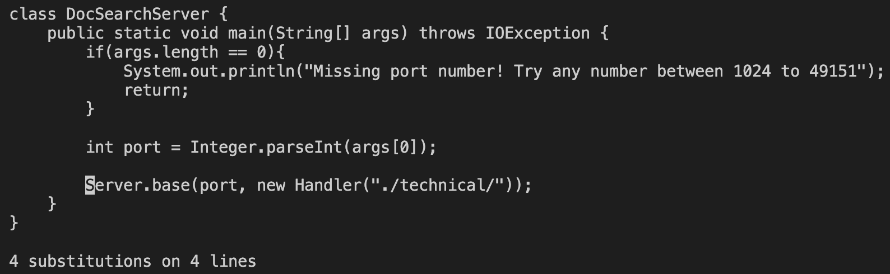

* :%s/start/base/g
* <enter>
* This command specifies that it is searching the entire file with %, and then uses find and replace to switch out start with base

  
* it took me 1:31 to copy over the file after i've edited it, and 1:17 to edit the file in the remote server.
* neither were difficult, but the first was a bit more tedious
* I would prefer using the second system, because it makes it a little more efficient not having to copy over the file
* If the file was really big, I would probably like to use the second system that way I don't have to keep all the files locally.
