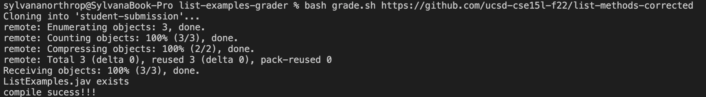
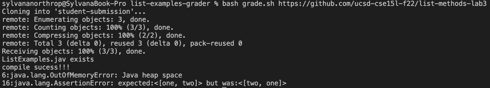
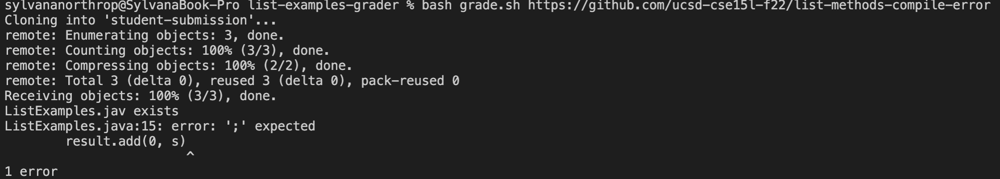

set -e

rm -rf student-submission
git clone $1 student-submission

cd student-submission
if test -f ListExamples.java
then 
    echo "ListExamples.jav exists"
else 
    echo "ListExamples.java does not existtttttttt"
    exit 1
fi

cp ListExamples.java ../

cd ..
javac -cp ".:lib/hamcrest-core-1.3.jar:lib/junit-4.13.2.jar" TestListExamples.java ListExamples.java
if test $? -eq 0;
then
    echo "compile sucess!!!"
else 
    echo "quit CS!! you're so pretty"
    exit 1
fi

set +e 

java -cp ".:lib/junit-4.13.2.jar:lib/hamcrest-core-1.3.jar" org.junit.runner.JUnitCore TestListExamples > score.txt

grep -n "Error:" score.txt

Trace for ex. 1
* standard output was a report that both tests had passed
* standard error was empty
* return code was zero because no errors
* Line 7 if statement: Listexamples works, does not run
* Line 19 if statement: exit code is not zero, does not run
* Does not run: 8-9, 20-21
